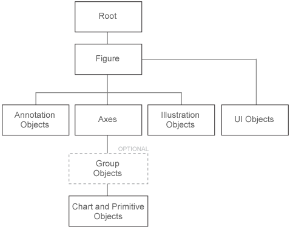

# Minesweeper

这个仓库主要用来用扫雷的例子来对`MATLAB`的`GUI`设计写一个较为细致的教程. 包括如何新建按钮(`pushbutton`)等等简易的`uicontrol`, 还有如何与键盘鼠标交互等等.

[TOC]
## 1. 基本的GUI知识
### 0.coding-review
写在最前面, 这个[文件](./coding_review.m), 是用来对代码进行比较修改的, 尽可能使用向量化的编程的语句, 其中会有必要的解释说明.

### 1. 图(figure)的组成
在`matlab`中, 一幅图(figure)是有层次(hierachy)的.



图形对象的分层特性反映了对象之间的相互包含关系, 每个对象在图形显示中起特定作用. 一般来说, 你使用`plot` 或者`line`函数创建一条线, `matlab`会自动先帮你创建一个图(figure), 接着帮你创建一个轴(`axes`), 如果你没有自己新建的话. 现在这副图就有了最基本的层次关系`figure-axes-(plot, line, legend, text...)`

```matlab
plot(rand(4))
f = gcf; % get current figure
f.Children % children object of the current figure
a = gca; % get current axes
a.Children % children object of the current axes
```

接下来会主要介绍的是`figure` 和 `axes`这两个对象.

#### 1. position

先说说这个位置(`position`)这个东西啊. 其实这个东西说麻烦也挺麻烦的, 因为里面有一些比较细致的问题需要知道. 而且想要把整个布局做的美观一些, 还是需要每个小控件之间有一定距离, 搞清楚`position`怎么设置的是很重要的. 其实`position`的四个数字就是边界,  依次分别是left, buttom, width, height. 前两个数字就是左下角的坐标, 接着两个数字就是这个东西的宽和高.

但是很明显现在有这样的问题, 我用什么表示坐标和宽高呢. 这里`MATLAB`提供了`Unit`的属性, 可以让你指定使用不同的方式来设置位置. 下面以`figure`为例来说明, 其他控件的位置设置也都是类似的. 

###### 1. 'pixels' (default)     
 使用分辨率来设置位置, 这个是绝对的位置, 所以如果你希望你的图片需要在**任何**电脑上都是指定位置显示的话就使用这个吧. 例如设置`position`为[120, 200, 100, 100], 那么在任何电脑上该图片的左下角的坐标都是[120,200], 以你的屏幕左下角为坐标原点, 单位就是像素点, 比如说你的屏幕是1280*1024, 那就是说屏幕右上角的坐标是[1280,1024], 这样你也就大致知道了[120, 200]在哪了. 

###### 2. normalized        
但是一般而言我们希望图片可以居中, 那么使用像素点的方式就没有那么方便, 但是此时使用`normalized`就可以设置比例, 比如设置`position`为[0.2 0.3 0.1 0.1], 那么就是认为右上角的坐标为[1,1], 然后按照比例计算这个位置. 例如如果我们希望图片居中, 那么图片的位置可以设置为[0.3 0.4 0.4 0.2].

###### 3. 其他的单位(Unit)

具体可以参见`MATLAB`的[官方文档][1], 上面两种是主要的使用的单位, 就在这里具体说一下, 其他的单位也是类似的, 就不再赘述了.

###### 4. Example
给定N, 画出一个N*N 的正方格子, 每个格子都是一个`uicontrol`. 要求: 任意修改N的数值不会改变图片的布局. 
```matlab
N = 10;
squ_size = 500/N;
hf = figure('resize','off','name','Minesweeper','unit','pixels',...
    'position', [400 100 (N+5)*squ_size (N+3)*squ_size],...
    'numbertitle', 'off','menubar','none','color', [205 197 191]/255);
t = axes('Units','pixels', 'PlotBoxAspectRatio',[1 1 1],...
    'Position',[squ_size,squ_size,N*squ_size,N*squ_size],...
    'XLim',[0 N*squ_size],'YLim',[0 N*squ_size],'xtick',[],'ytick',[],...
    'XColor','k','YColor','k', 'visible','on','Color',[205 197 191]/255);
line(repmat([0;squ_size*N],1,N+1),repmat(0:squ_size:N*squ_size,2,1),'color','k');
line(repmat(0:squ_size:squ_size*N,2,1),repmat([0;squ_size*N],1,N+1),'color','k');
h = gobjects(N,N);
for counter = 1:N^2
    jcols = rem(counter,N);
    jcols(jcols==0) = N;
    irows = ceil(counter/N);
    position = [squ_size+(jcols-1)*squ_size squ_size+(N-irows)*squ_size squ_size squ_size];
    h(counter)=uicontrol('FontSize',18,'FontWeight','bold',...
        'Position',position,'Style','pushbutton');
end
```
这里还有一个关于`image`画出炸弹和小旗子的[详解](./image_fcn.md)

### 2. uicontrol
#### 1. pushbutton
这个是最常用的一个类型, 在上面的这个例子中也使用到了这个类型, 就不再叙述了.
#### 2.popumenu
弹出菜单, 这个主要用于选择的.例如
```matlab
clear;clc;close all
global h
h = uicontrol('style','popupmenu','string',{'a','b','c'},'callback',@popupmenu_callback);
function popupmenu_callback(~,~)
global h
str = get(h,'string');
val = get(h,'value');
disp(['Your choice is: ', str{val}])
end
```
这里我们通过`value`可以`get`到你选择的是第几个选项, 这样就可以进行后续的操作了
#### 3. 其他的`uicontrol`的集合
下面就是集成的例子
```matlab
clear;clc;close all
global  h_title h_line
x = 0:0.1:2*pi;
y = sin(x);
h_line = plot(x,y);
h_title = title('');
h_checkbox = uicontrol('style','checkbox','string','Exhibit title','callback',...
    @checkbox,'position',[100 200 80 20]);
c = uicontrol('Style','radiobutton','String','This is s fake button',...
    'position',[100 100 120 20]);
h_popupmenu = uicontrol('style','popupmenu','string',{'sin(x)','cos(x)'},'callback',...
    @popupmenu_callback,'position',[300 200 50 20]);
h_listbox =  uicontrol('style','listbox','string',{'blue','dark','red','green'},'callback',...
    @listbox_callback,'position',[330 100 50 50]);
h_slider =  uicontrol('Style','slider','SliderStep',[0.01 0.10],'callback',...
    @slider_callback,'position',[330 270 20 80]);
h_togglebutton =  uicontrol('Style','togglebutton','callback',...
    @togglebutton_callback,'position',[360 240 120 30],'string','click to change linestyle');
hpushbutton =  uicontrol('Style','pushbutton','callback',...
    @pushbutton_callback,'position',[360 340 120 30],'string','click to change linestyle');
function checkbox(src,~)
global h_title
if get(src,'value'); set(h_title,'string','This is a curve')
else;set(h_title,'string','');end
end
function popupmenu_callback(src,~)
global h_line
if get(src,'value') == 1;set(h_line,'ydata',sin(0:0.1:2*pi))
else;set(h_line,'ydata',cos(0:0.1:2*pi));end
end
function listbox_callback(src,~)
global h_line
c = [0,0,1;0 0 0;1 0 0;0 1 0];
set(h_line,'color',c(get(src,'value'),:));
end
function slider_callback(src,~)
global h_line
set(h_line,'linewidth',0.5+get(src,'value')*3);
end
function togglebutton_callback(src,~)
global h_line
if get(src,'value');set(h_line,'linestyle','--');
else; set(h_line,'linestyle','-');end
end
function pushbutton_callback(src,~)
global h_line
if get(src,'value');set(h_line,'linestyle',':');
else; set(h_line,'linestyle','-');end
end
```
实际上这些不同类型的`uicontrol`的用法都是类似的, 具体也可以参见`uicontrol`的[官方文档][2]


### 3. 鼠标的交互
#### 1. 图片(figure)的鼠标按键的响应

```matlab
function test_figure_mouse
hf = figure;
set(hf,'ButtonDownFcn',@click_type);
end
function click_type(src,~)
disp(get(src,'selectiontype'))
%注意到这个`selectiontype`, 左键点击是`normal`, 右键是`alt`, 滚轮点击是`extend`.
end
```
注意到这里使用的是`buttondownfcn`这个方法(或者叫属性)来响应你的鼠标点击这个事件. 与`uicontrol` (`style`是`pushbutton`的时候)稍稍不同的在于, 一般我们使用`callback`来响应, 这个是鼠标左键点击才会响应的, 差不多属于`uicontrol`特有的一个功能吧. 一般滴, 我们是使用`buttondownfcn`来实现鼠标点击的响应的. 

#### 2. 一些控件(uicontrol)的鼠标按键的响应
上面我们已经讲到, `uicontrol`的`callback`就可以实现鼠标左键点击的响应, 但是`uicontrol`也有`buttondownfcn`这个方法, 所以使用`buttondownfcn`就可以实现鼠标右键和滚轮的响应了.

```matlab
function test_mouse
hf = figure;
uicontrol('style', 'pushbutton', 'string', 'test', 'fontsize',16, 'fontweight','bold',...
    'fontname', 'Times New Roman','FontAngle', 'italic',...
    'units', 'normal', 'position',[0.18 0.6 0.1, 0.1], 'parent', hf,...
    'fontweight', 'bold', 'callback', @call_back, 'buttondownfcn',@click_type);
end
function call_back(~,~)
disp('This is from callback');
end
function click_type(src,~)
figHandle = ancestor(src, 'figure');
clickType = get(figHandle, 'SelectionType');
disp(clickType)
end
```
这里注意到我们有两个回调函数, 一个是`callback`的, 一个是`buttondownfcn`的, 可以看到在鼠标左键点击的时候默认使用的是`callback`对应的回调函数的. 另外需要注意到的是, 因为`selectiontype`是`uicontrol`所没有的, 所以只能根据`uicontrol`所在的`figure`来判断到底是哪种点击方式, 所以`fighandle = ancestor(src,'figure')`就是在寻找`uicontrol`所在的`figure`, 接着`get`该图片(figure)的`selectiontype`, 就可以得知鼠标的点击方式了.

### 4. 键盘的交互
[biaoti](#minesweeper)


## 2. 扫雷

### 1. 扫雷需要实现的功能
- [x] 左键单击显示炸弹, 或者数字, 或者连起来的空位
- [x] 重新开始游戏, 建立一个`uicontrol`, 最好是笑脸, 单击就可以重新设置炸弹的分布
- [x] 说到开始游戏, 以免第一次就点击到了炸弹, 可以设置在你左键点击开始的时候才分配炸弹, 这样就可以保证第一次不会碰到炸弹 了
- [x] 右键单击显示小旗子, 再次右击去掉小旗子, 注意到小旗子是有限的, 使用完了就没有了, 所以需要显示小旗子的剩余量
- [x] 如果点击到了炸弹, 炸弹会全部爆出来, 注意如果你插上的小旗子是正确的, 那么那个地方的炸弹是不需要爆出来的, 其他地方的炸弹都要显示出来, 错误的小旗子可以显示一个红会的背景? 或者其他的以示区分
- [x] 当然还需要有计时功能, 这个详解在[这里](./timeui.md). 有了计时之后可能就需要做一个排行榜的东西...
- [x] 接着就是设置难度这个东西, 其实最初已经做好了一定的准备, 就是可以灵活的设置方块的个数就可以控制难度了. 所以我觉得可以设置成这样, 难度默认有简答, 中等和困难三个模式, 也可以自定义`N`(当然这个`N`需要有一定范围, 不能太大), 这个可以设置成下拉菜单的模式, 也就是`popumenu`这个类型的`uicontrol`, 这个[类型][3]在上面有讲到.


  [1]: https://www.mathworks.com/help/matlab/ref/figure.html#buich1u-1_sep_shared-Units
  [2]: https://www.mathworks.com/help/matlab/ref/uicontrol.html
  [3]: https://github.com/ChangChunHe/Minesweeper/blob/master/README.md#2popumenu
